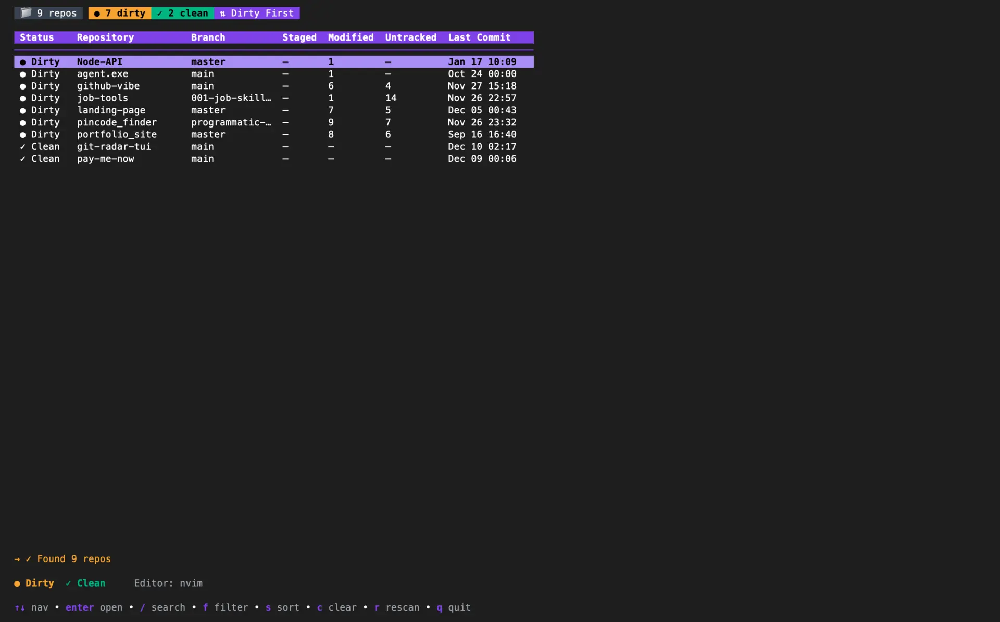

# git-scope

> A fast TUI to see the status of all git repositories on your machine.


[](LICENSE)

<p align="center">
  
</p>

**[🌐 Visit the Landing Page](https://bharath-code.github.io/git-scope/)**

## Overview

**git-scope** is a terminal-based dashboard that helps you manage multiple git repositories. It scans your configured directories, shows you which repos have uncommitted changes, and lets you jump into your editor with a single keystroke.

### Features

- 🔍 **Fuzzy Search**: Find any repo by name, path, or branch with `/`
- 🛡️ **Dirty Filter**: Press `f` to see only repos with uncommitted changes
- ⚡ **Fast caching**: Instant startup using JSON caching
- 📊 **Dashboard**: Shows branch, staged/unstaged counts, and last commit
- ⌨️ **Keyboard-driven**: Vim-like navigation (`j`/`k`) and sorting (`s`)
- 🚀 **Quick Jump**: Open any repo in your editor (VSCode, nvim, etc.) with `Enter`

## Installation

### Homebrew (macOS/Linux)
```bash
brew tap Bharath-code/tap
brew install git-scope
```

**To Update:**
```bash
brew upgrade git-scope
```

### From Source
```bash
go install github.com/Bharath-code/git-scope/cmd/git-scope@latest
```

## Usage

### Launch TUI
```bash
git-scope
```

### Configuration
On first run, `git-scope` will auto-detect your directories. To customize, edit `~/.config/git-scope/config.yml`:

```yaml
roots:
  - ~/code
  - ~/work

ignore:
  - node_modules
  - .venv

editor: code  # or nvim, vim, helix
```

## Keyboard Shortcuts

| Key | Action |
|-----|--------|
| `/` | **Search** repos |
| `f` | Toggle **Filter** (All/Dirty/Clean) |
| `s` | Cycle **Sort** mode |
| `1-4` | Sort by Dirty/Name/Branch/Recent |
| `c` | **Clear** search & filters |
| `Enter` | **Open** repo in editor |
| `r` | **Rescan** directories |
| `q` | **Quit** |

## Roadmap

- [ ] Background file watcher
- [ ] Quick actions (pull, push)
- [ ] Team dashboards

## License

MIT
